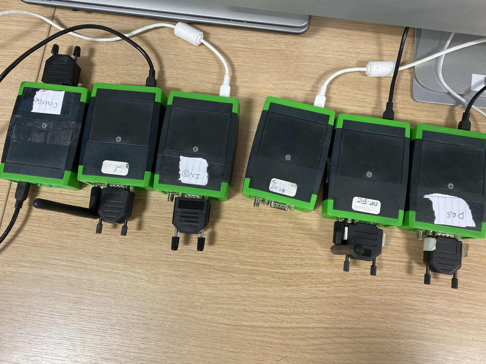
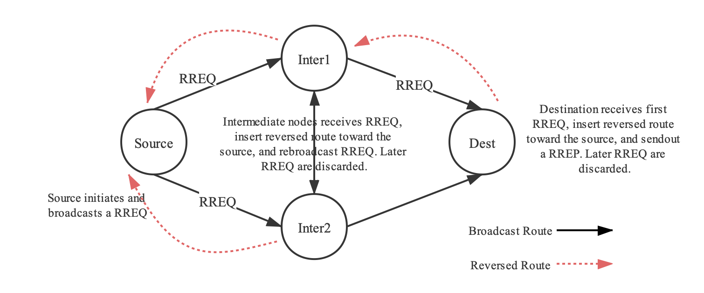
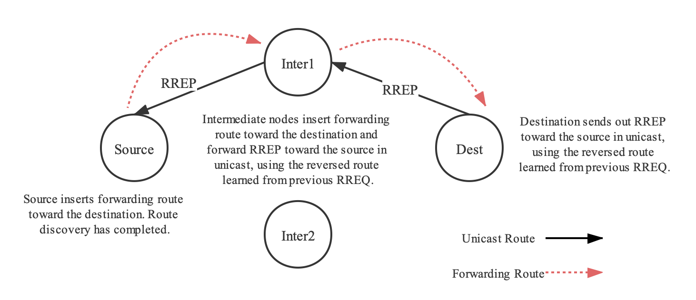

# An Ad Hoc Wireless Sensor Network
2019 COP531 **Wireless Networks** Coursework


## Introduction

In this report, we build a simple ad hoc wirelss sensor network composed of six Sensinode devices.
Among them one is designated as the source device, one is the destination device and others are intermediate devices.




> All Six Nodes in the Network.


The source device learns a route to the destination device from a simplified version of Ad Hoc On-Demand Distance Vector (AODV) routing protocol. The route to the destination device could be either directly or through intermediate devices. The source device sends a packet containing sensor readings to the destination regularly and expects an acknowledgement from the destination.




> AODV: Broadcasting a Request (RREQ) in AODV Protocol.




>  AODV: Forwarding a Reply (RREP) in AODV Protocol.


We conclude that we have successfully achieved all the required functions. The proposed implement method of our algorithm worked very well and stable in the laboratory environment.


## Usage

Change into `code` folder and compile the programs.

```sh
make
```

Download `source.ihx` program onto the source node.

```shell
nano_programme -p 0 -f source.ihx -W
```

Download `dest.ihx` program onto the destination node and all intermediate nodes.

```shell
nano_programme -p 0 -f dest.ihx -W
```

Restart all nodes and you are good to go.


Loughborough University

© Group Three, 2020